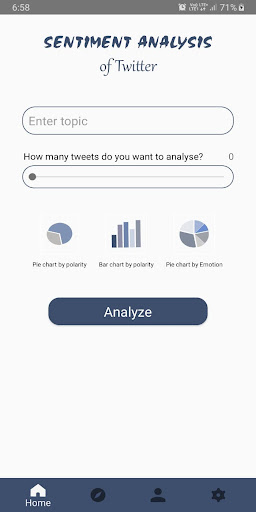
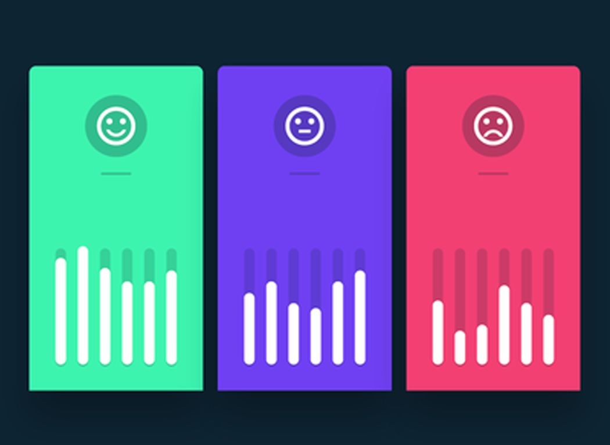

# Sentiment Analysis with google photos images

## Overview  
This project lays out an application for Android implement a system to detect emotions through image recognition from Google Photos repository. Finally, the program returns the images and the scores that got evaluated.

## User Guide 

1. Go to the **Android APK** folder and download the APK for android smartphones.
2. Copy the APK to your phone.
3. In your phone, search for the APK and install it. If your phone asks for confirmation or permission to install the apk, accept.
4. For login:
    Register with a google account to aunthenticate, if you do not have a google account, you must create one.
5. Select the photos from the Google Photos repository.
6. Begin the sentiment analysis and display the results.
7. If you want to delete your personal information, the app gives the option to do it.
 
 ## Troubleshooting
Bugs can be reported in the issue tracker on our GitHub repo: https://github.com/Zethearc/Software-Engineering/issues4


## For Developers - Libraries needed to run the application code


  plugins   {   
      id 'com.android.application' version '7.2.1' apply false  
      id 'com.android.library' version '7.2.1' apply false  
      id 'org.jetbrains.kotlin.android' version '1.6.10' apply false  
      id "com.google.gms.google-services" version "4.3.13" apply false  
      id implementation 'com.google.firebase:firebase-analytics:21.1.0'  
      id implementation 'com.google.firebase:firebase-auth:21.0.6'  
  }
## Importing the Project on Android Studio
1. Clone or download this repository:
     ```
     git clone (https://github.com/Zethearc/Software-Engineering.git)
     ```
2. Open Android Studio
3. Click on File -> New -> Import Project
     - **First Time using Android Studio:** Click Open an existing Android Studio project
4. Search for the directory `Sotfware-Enginnering.git` and select it.
5.  click OK and wait for it to sync.

The application will use the images to perform an analysis of the emotions displayed and will generate a tag for the images and a category to which it belongs.
1. **Inputs:** A batch of images.
2. **Source:** Google Photos or user’s phone gallery.
3. **Output:** A category and tag for each image. 
4. **Destination:** Main application interface.
5. **Requirements:** An initial batch of 8 photos. Photographs containing different elements on scene.


## Authors of this project
Astudillo Jaime jaime.astudillo@yachaytech.edu.ec - [LinkedIn](https://www.linkedin.com/in/jaime-astudillo-664754228/)  
Cabezas Dario  dario.cabezas@yachaytech.edu.ec - [LinkedIn]   
Camacho Jean   jean.camacho@yachaytech.edu.ec - [LinkedIn](https://www.linkedin.com/in/jean-camacho-126126212)  
De la Cruz Franklin franklin.de@yachaytech.edu.ec - [LinkedIn]   
Figueroa Saul. saul.figueroa@yachaytech.edu.ec - [LinkedIn]  
Moncada Claudia. claudia.moncada@yachaytech.edu.ec - [LinkedIn]  
Quelal Andres. andres.quelal@yachaytech.edu.ec - [LinkedIn]    
Quizhpe Edwin. edwin.quizhpe@yachaytech.edu.ec - [LinkedIn]  
Zapatier Luis. luis.zapatier@yachaytech.edu.ec - [LinkedIn]  

## Demo of the App (Screenshots)
### Login
The first step in the App is to get login with your own credentials or by the Google Account. The user can choose one of them and get into the App. 


### Select photos from Google Photos
The second step for the user is to upload their photos from Google Photos. For this the user must select the number of photos of his preference from Google Photos and upload them to the App. 

### Sentiment Analysis
The third step for the user after registration is to begin sentiment analysis. Then, the sentiment analysis will start with the uploaded data. The final result is the display of a text string of the analysis and graphs corresponding to the result.



